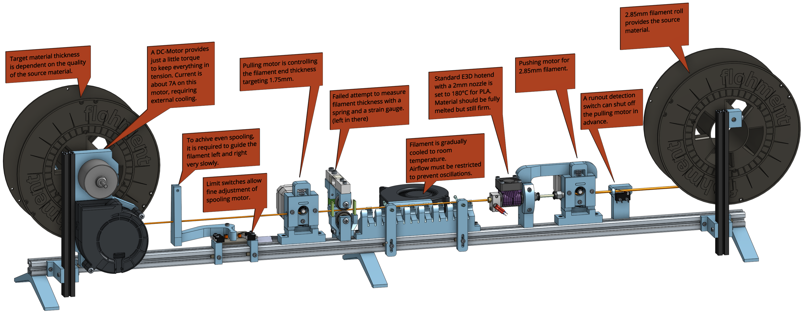

# refilamentierer

A device that converts 3mm filament to 1.75mm filament.

CAD Onshape:
https://cad.onshape.com/documents/ed6cd330be3511d378da13da/w/5bec0a05ca762b80c3a29dc1/e/c4a9879352a83fbbf845b2fc?renderMode=0&uiState=6347384540b40c0a16c41f6b

Grab CAD:
https://grabcad.com/library/filament-converter-1

